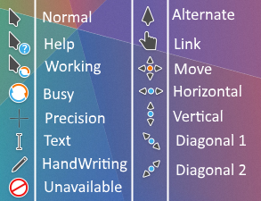

# Breeze Cursor for Windows

## Fork

@az4521's [Breeze Cursors for Windows](https://www.deviantart.com/az4521/art/Breeze-Cursors-for-Windows-628166238)

## Install
1. Open 'Final' folder
2. 'KDE Breeze Install.inf' right click && Select Install
3. Control Panel - Hardware and Sound - mouse
4. Pointer tab - select 'KDE Breeze Dark' Select && Apply

## What Fixes??
'KDE Breeze Install.inf' Bug fix
